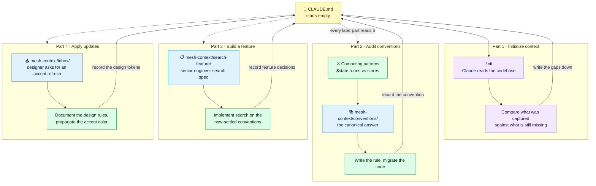
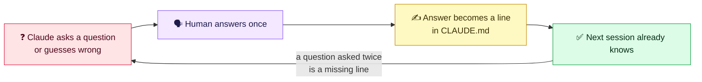
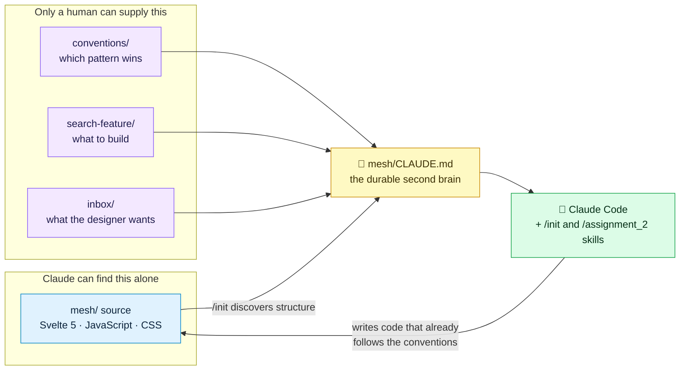

## Architecture

A four-part walkthrough in context engineering, built around **mesh** — a Svelte 5 semantic note-graph app that ships with a deliberately empty `CLAUDE.md`. Each part surfaces a different kind of context gap: what `/init` can discover on its own, what only a human can settle (competing patterns), what arrives as a written spec, and what arrives as a design request. The artifact that grows across all four is `CLAUDE.md` itself — the second brain of the title.

### The context loop



### Ask once, write it down, never asked again



### Where context comes from



The split matters: `/init` is good at what the code already shows — file layout, framework, scripts. It cannot tell you that `$state` runes beat stores, that search should behave a particular way, or which accent color the designer picked. Those three live in `mesh-context/` precisely because they are the kind of knowledge that has to be written down by hand, once.

### The four parts

| Part | The gap it exposes | What you do | What lands in `CLAUDE.md` |
| --- | --- | --- | --- |
| 1 · Initialize context | Nothing is documented | Run `/init`, then audit what it missed | Structure, stack, commands — plus the gaps |
| 2 · Audit conventions | Two patterns compete | Read `conventions/`, pick the canon, migrate | The rule, stated once and enforceably |
| 3 · Build a feature | The spec lives outside the repo | Implement search from the written spec | Feature decisions and their rationale |
| 4 · Apply updates | Design intent lives in an inbox | Document the design rules, propagate the accent color | Design tokens and styling conventions |

### Repository layout

```
mesh/                            Working Svelte 5 app — starts with an empty CLAUDE.md
mesh-context/
├── conventions/                 Canonical patterns that resolve competing approaches
├── search-feature/              Senior-engineer search spec (revealed in part 2)
└── inbox/                       Designer email requesting an accent-color refresh
.claude/skills/assignment_2/     The walkthrough skill
```

Run `/assignment_2` from `mesh/` to start the walkthrough.
